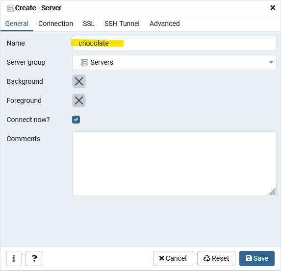
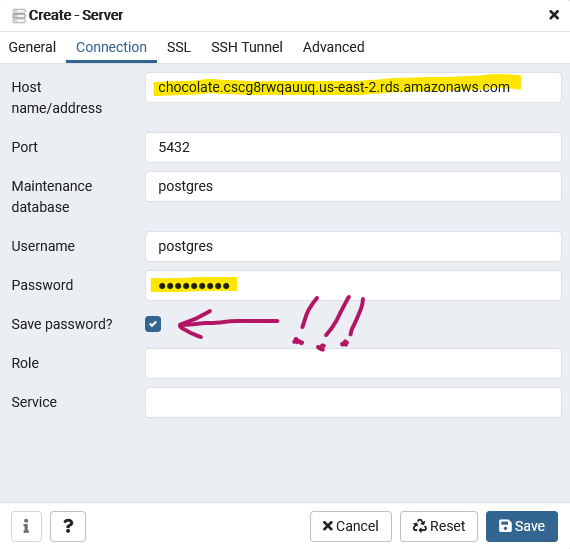
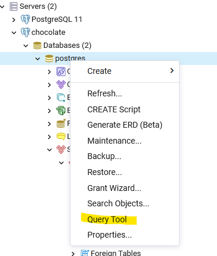
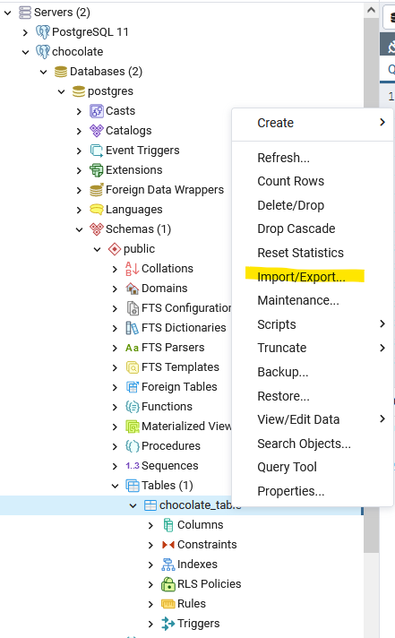
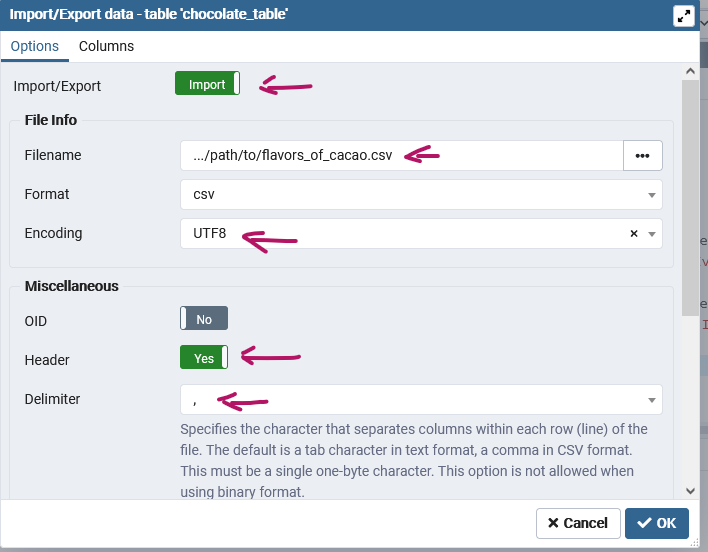
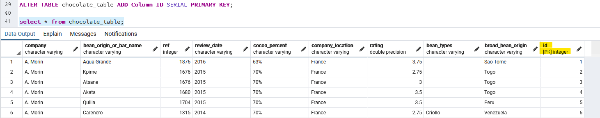
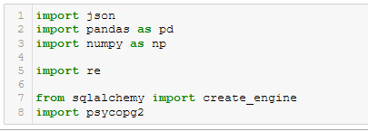
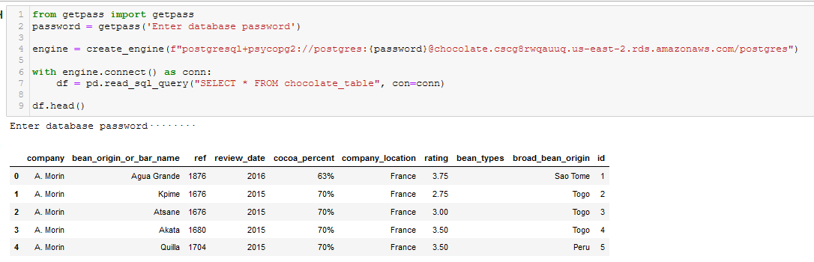

# README_DATABASE.md

### Info:

- Everyone can use my RDS instance, but please don't drive up my bill. Hopefully we can complete this project inside the 'free' limit.
- The path to the RDS server is **chocolate.cscg8rwqauuq.us-east-2.rds.amazonaws.com**
- The name of the database on AWS is **chocolate** (the prefix above)
- The user is **postgres**
- The port is **5432**
- I'll Slack the password to the team.

### Steps:
1. Start pgAdmin
2. Create a new 'Server' which will point the Amazon RDS server. It will populate with available databases.

  

3. Set Server name ('chocolate' in this case) but don't click 'Save' yet.

  

4. Set Connection. Specify host (see above), enter password, and **select 'Save password'**

  

5. Right click the 'postgres' database inside the 'chocolate' server to start the Query tool

  

6. Copy/paste the following SQL code into Query tool, select it with mouse, and run to create the 'chocolate_table'. Note that the CSV file we will use does not have an index, so I can't set the SERIAL 'ID' field yet. We do that later, after we've read the CSV, with an 'ALTER TABLE' command.

    ```
    -- uncomment and run the following line to delete the table from the database if needed
    --DROP TABLE chocolate_table CASCADE;

    CREATE TABLE chocolate_table (
        Company VARCHAR,
        Bean_Origin_or_Bar_Name VARCHAR,
        REF INTEGER,
        Review_Date VARCHAR,
        Cocoa_Percent VARCHAR,
        Company_Location VARCHAR,
        Rating FLOAT,
        Bean_Types VARCHAR,
        Broad_Bean_Origin VARCHAR
    );
    ```

7. (Optional) Do a few CRUD ops, then Do the 'DROP TABLE' command and redo step 6 again.

    ```
    -- 'C'reate a fake 'Hershey' bar
    INSERT INTO chocolate_table (Company,Bean_Origin_or_Bar_Name,REF,Review_Date,Cocoa_Percent,Company_Location,Rating,Bean_Types,Broad_Bean_Origin)
    VALUES ('Hershey','Dark Almond Crunch',1234,2021,70.3,'USA',3.5,'Criollo','Côte d''Ivoire');

    -- 'C'reate a fake 'Hershey2' bar
    INSERT INTO chocolate_table (Company,Bean_Origin_or_Bar_Name,REF,Review_Date,Cocoa_Percent,Company_Location,Rating,Bean_Types,Broad_Bean_Origin)
    VALUES ('Hershey2','Dark Almond Crunch',1234,2021,70.3,'USA',3.5,'Criollo','Côte d''Ivoire');

    -- 'R'ead back the data
    select * from chocolate_table;

    -- 'U'date the 'Hershey2' bar
    UPDATE chocolate_table SET Company = 'Yucky Chocolate' WHERE Company = 'Hershey2';
    select * from chocolate_table;

    -- 'D'elete the 'Hershey' bar
    DELETE from chocolate_table WHERE Company = 'Hershey'
    select * from chocolate_table;
    ```

8. Select the Import command.

    

9. Fill out the Import fields (NOTE: I manually edited the offending entry for 'Bean_Origin_or_Bar_Name' in the CSV file with the embedded single quotes inside double quotes)

    

10. Now modify the table to have a unique ID column that can be used for joins, etc.

    ```
    ALTER TABLE chocolate_table ADD Column ID SERIAL PRIMARY KEY;
    ```

11. Verify that it worked

    

12. Imports for python

    

13. Option1: Read RDS database with psycopg2:

    

14. Option2: Read RDS database with JDBC:

    Not ready for this yet.
