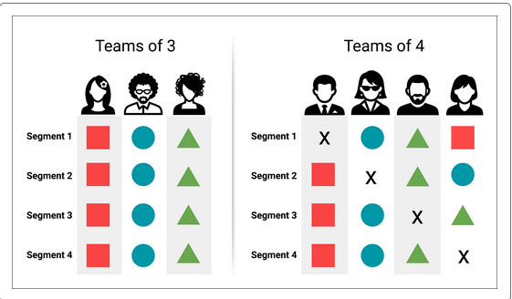

# DataBootcampFinalProject

## Rev2 - Correctly set up branches

I read through the lecture slides, and realized that I had set up the repo & branches incorrectly.

I fixed the branches so that they match what was in the instructions. That is to say, everything is in the top-level **DataBootcampFinalProject** directory, not down in **DataBootcampFinalProject/\<user\>** directories.

##### The new structure is:

		README.md - the file you are reading now
		.gitignore - don't push unecessary files/dirs from Tensorflow / Keras:
		ChocolateBarRatings.ipynb - the jupyter notebook code
		cleaning.ipynb - Tahereh's new code to clean data in CSV file
		ChocoloateBarRatings_opt1.h5 - the saved NN model
		Resources - a place to hold data, etc.
			archive.zip - the original zip file from kaggle
			flavors_of_cacao.csv - same as the one in archive.zip, but with minor edit to header row
		Images - a place to put screenshots or other images (see sample image below)


##### The old structure was:

		README.md - the file you are reading now
		Bruce/
			README.md - empty
			chocolate_bar_ratings/
				archive.zip - the original zip file from kaggle
				ChocolateBarRatings.ipynb - the jupyter notebook code
				ChocoloateBarRatings_opt1.h5 - the saved NN model
				flavors_of_cacao.csv - a slightly modified csv file from the zip
		Tahereh/
			README.md - empty
		Travis/
			README.md - empty
		Yan/
			README.md - empty

1. Everything is in the DataBootcampFinalProject directory.
2. This is the list of branches:
```
			Bruce
			Tahereh
			Travis
			Yan
			main
```
3. The main branch has the most recent code as of now (including Tahereh's latest addition).
4. Please refer to https://github.com/jilek/DataBootcampFinalProject/blob/main/Doc/Supplementary_%2BGitHub.pdf for more info on Git usage.

**Remember to make sure you are on the correct branch when you do your work**

To run the code:

$ cd Bruce/chocolate_bar_ratings
$ jupyter notebook - then open/run ChocolateBarRatings.ipynb


Here's how to include an image in a .md file like README.md


