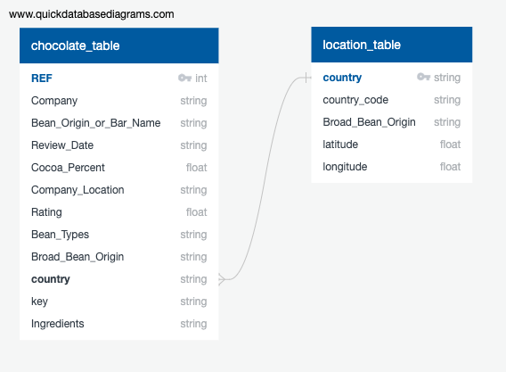

# DataBootcampFinalProject Segment1 Deliverable

**This is the Segment1 Deliverable for the Data Analytics Bootcamp Final Project.**

## Overview

- **Topic**: Our team will create a NN to determine the 'rating' of chocolate from this kaggle dataset.
- **Reason**: Because we love chocolate. The scientific name is *Theobroma cacao* (Theobroma means "Food of the gods")
- **Data Sources**:

    - [Kaggle Chocolate Bar Ratings](https://www.kaggle.com/rtatman/chocolate-bar-ratings)
    - [Flavors of Cacao](http://flavorsofcacao.com/chocolate_database.html)
    - [Kaggle Countries and States Lat Lon](https://www.kaggle.com/paultimothymooney/latitude-and-longitude-for-every-country-and-state)

- **Questions we want to answer**:
    1. Can we predict which chocolate bars will be rated in the top 15% (i.e. Rating >= 3.75, one Standard Deviation above the Mean), based on:
        + Review date: How recent was the review?
        + Cocoa Percent: Ranges from 42% to 100%
        + Bean Type: Criollo, Trinitario, or Forastero
        + Broad Bean Origin: Country where the cocoa beans were grown

    2. Where are the best cocoa beans grown?
    3. Which countries product the hightest-rated bars?
    4. What's the relationship between cocoa solids percentage and rating?

 - References:
    + [Cacao Varieties - Willie's cacao](https://www.williescacao.com/world-cacao/different-cacao-varieties/)
    + [Cocoa Bean - Wikipedia](https://en.wikipedia.org/wiki/Cocoa_bean)

Table 1 - Team Roles for this Project

| Deliverable  | Role     | Member |
| :--          | :--      | :--    |
| Presentation | X?       | Travis |
| GitHub       | Square   | Bruce |
| ML Model     | Triangle | Tahereh / Bruce |
| Database     | Circle   | Yan |
| Dashboard    | X?       | Travis |

## Results

Table 2 - Rubric for Segment 1

| Segment | Item | Details |Points |
| :--     | :--  | :--     |   --: |
| 1 | [Presentation](https://github.com/jilek/DataBootcampFinalProject/blob/main/Segment1_Deliverable/Chocolate%20Bar%20Ratings%20Predictor.pdf) |  |  30 |
|   | Selected topic                                                 | Done: (see Overview above) |     |
|   | Reason for topic                                               | Done: (see Overview above) |     |
|   | Desc. of data source                                           | Done: (see Overview above) |     |
|   | Questions we want to answer                                    | Done: (see Overview above) |     |
| 1 | [GitHub](https://github.com/jilek/DataBootcampFinalProject/tree/main/Segment1_Deliverable) |   |  10 |
|   | Main branch includes a README.md                               | Done: this file            |     |
|   | README.md includes communication protocols                     | Done: Slack                |     |
|   | At least one branch for each team member                       | Done                       |     |
|   | Each member has at least 4 commits.                            | Done                       |     |
| 1 | [ML model](https://github.com/jilek/DataBootcampFinalProject/blob/main/Segment1_Deliverable/ChocolateBarRatings.ipynb) |  |  35 |
|   | Takes in data from the provisional database                    | Done: CSV for now          |     |
|   | Outputs label(s) for input data                                | Done: we predict 'Rating'  |     |
| 1 | Database                                                       |                            |  25 |
|   | Sample data the mimics the expected final DB schema            | Done: ERD and SQL now      |     |
|   | Draft machine learning module is connected to the provional DB | Done: CSV for now          |     |
| 1 | Dashboard                                                      |                            |   0 |
|   | n/a for segment 1                                              |                            |     |
| 1 | **Total**                                                      |                            | 100 |

Figure 1 - Entity Relationship Diagram (ERD) for the provisional Database

## Summary

**To be completed in future segments**
