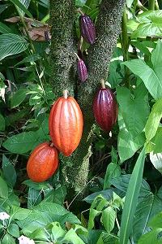
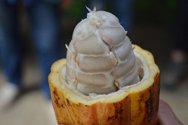
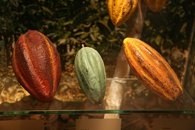

# DataBootcampFinalProject Segment1 Deliverable

**This is the Segment1 Deliverable for the Data Analytics Bootcamp Final Project.**

## Overview

- Topic: Our team will create a NN to determine the 'rating' of chocolate from this kaggle dataset.
- Reason: Because chocolate is *Theobroma - "The food of the gods"*
- Data Source: [Kaggle Chocolate Bar Ratings](https://www.kaggle.com/rtatman/chocolate-bar-ratings)
- Questions we want to answer:
    - Can we predict which chocolate bars will have a rating of >= 4.0 based on
        - Bean Type
        - Cocoa Percent
        - Review date
    - **Other questions?**

 - References:
    - [Cacao Varieties - Willie's cacao](https://www.williescacao.com/world-cacao/different-cacao-varieties/)
    - [Cocoa Bean - Wikipedia](https://en.wikipedia.org/wiki/Cocoa_bean)

| Ripening Beans on Tree | Beans with flesh in pod | Bean Types: Criollo, Trinitario, Forastero |
| :--:    | :--:       | :--:      |
|  |  |  |

Table 1 - Team Roles for this Project

| Deliverable | Role | Member |
| :-- | :-- | :-- |
| Presentation | X? | Travis |
| GitHub | Square | Bruce |
| ML Model | Triangle | Tahereh / Bruce |
| Database | Circle | Yan |
| Dashboard | X? | Travis |

Figure 1 - Team Roles Diagram

## Results

Table 2 - Rubric for Segment 1

| Segment | Item | Details |Points |
| :--     | :--  | :--     |   --: |
| 1 | Presentation                                                   |                            |  30 |
|   | Selected topic                                                 | Done: (see Overview above) |     |
|   | Reason for topic                                               | Done: (see Overview above) |     |
|   | Desc. of data source                                           | Done: (see Overview above) |     |
|   | Questions we want to answer                                    | Done: (see Overview above) |     |
| 1 | GitHub                                                         |                            |  10 |
|   | Main branch includes a README.md                               | Done: this file            |     |
|   | README.md includes communication protocols                     | Done: Slack                |     |
|   | At least one branch for each team member                       | Done                       |     |
|   | Each member has at least 4 commits.                            | **TODO: Yan**              |     |
| 1 | ML model                                                       |                            |  35 |
|   | Takes in data from the provisional database                    | Done: CSV for now          |     |
|   | Outputs label(s) for input data                                | **???**                    |     |
| 1 | Database                                                       |                            |  25 |
|   | Sample data the mimics the expected final DB schema            | Done: ERD and SQL now      |     |
|   | Draft machine learning module is connected to the provional DB | **Done: CSV for now???**   |     |
| 1 | Dashboard                                                      |                            |   0 |
|   | n/a for segment 1                                              |                            |     |
| 1 | **Total**                                                      |                            | 100 |

## Summary

This is a summary of the results **To be completed in future segments**

The summary for most Challenge assignments contains at least one recommendation on how to improve the results and why.
