# DataBootcampFinalProject Segment2 Deliverable

**This is the Segment2 Deliverable for the Data Analytics Bootcamp Final Project.**

## Overview

- **Topic**: Our team will create a Neural Network to determine the 'rating' of chocolate from this Kaggle dataset.
- **Reason**: Because we love chocolate. The scientific name is *Theobroma cacao* (Theobroma means "Food of the gods")
- **Data Sources**:

    - [Kaggle Chocolate Bar Ratings](https://www.kaggle.com/rtatman/chocolate-bar-ratings)
    - [Flavors of Cacao](http://flavorsofcacao.com/chocolate_database.html)
    - [Kaggle Countries and States Lat Lon](https://www.kaggle.com/paultimothymooney/latitude-and-longitude-for-every-country-and-state)


- **Questions we want to answer**:
    1. Can we predict which chocolate bars will be rated in the top 15% (i.e. Rating >= 3.75, one Standard Deviation above the Mean), based on:

        + Review date: How recent was the review?
        + Cocoa Percent: Ranges from 42% to 100%
        + Bean Type: Criollo, Trinitario, or Forastero
        + Broad Bean Origin: Country where the cocoa beans were grown

    2. Where are the best cocoa beans grown?
    3. Which countries product the hightest-rated bars?
    4. What's the relationship between cocoa solids percentage and rating?

 - References:
    + [Cacao Varieties - Willie's cacao](https://www.williescacao.com/world-cacao/different-cacao-varieties/)
    + [Cocoa Bean - Wikipedia](https://en.wikipedia.org/wiki/Cocoa_bean)

Table 1 - Team Roles for this Project

| Deliverable  | Role     | Member |
| :--          | :--      | :--    |
| Presentation | X?       | Travis |
| GitHub       | Square   | Bruce |
| ML Model     | Triangle | Tahereh / Bruce |
| Database     | Circle   | Yan |
| Dashboard    | X?       | Travis |

## Results

See Table A1 in the Appendix for the Segment1 Rubric

Table 2 - Rubric for Segment2

| Segment | Item | Details |Points |
| :--     | :--  | :--     |   --: |
| 2 | **[Presentation as PDF](https://github.com/jilek/DataBootcampFinalProject/blob/main/Segment2_Deliverable/Chocolate%20Bar%20Ratings%20Predictor.pdf)** | |  15 |
|   | **[Presentation as Google Slides](https://drive.google.com/drive/folders/1R4K90dXMlQ8stR5bSdv7_Ihnfq-KnghP)** | | |
|   | Selected topic                                                 | Done: See Overview above |     |
|   | Reason for topic                                               | Done: See Overview above |     |
|   | Desc. of data source                                           | Done: See Overview above |     |
|   | Questions we want to answer                                    | Done: See Overview above |     |
|   | Description of the data exploration phase of the project       | Done: See Section 1 below)                    |     |
|   | Description of the analysis phase of the project               | Done: See Section 2 below                   |     |
|   | *Slides*                                                       |                            |     |
|   |  Presentations are drafted in Google Slides                    | Done: See [Presentation as Google Slides](https://drive.google.com/drive/folders/1R4K90dXMlQ8stR5bSdv7_Ihnfq-KnghP) |     |
| 2 | **GitHub**                                                     |                            |  10 |
|   | *Main branch*                                                  |                            |     |
|   | All code necessary to perform exploratory analysis             | Done: [Data_Clean.ipynb](https://github.com/jilek/DataBootcampFinalProject/blob/main/Segment2_Deliverable/Data_Clean.ipynb) , [EDA.ipynb](https://github.com/jilek/DataBootcampFinalProject/blob/main/Segment2_Deliverable/EDA.ipynb)      |     |
|   | Some code necessary to complete the machine learning portion   | Done: [EDA.ipynb](https://github.com/jilek/DataBootcampFinalProject/blob/main/Segment2_Deliverable/EDA.ipynb) , [Machine_Learning.ipynb](https://github.com/jilek/DataBootcampFinalProject/blob/main/Segment2_Deliverable/Machine_Learning.ipynb) ,  [ChocolateBarRatings.ipynb](https://github.com/jilek/DataBootcampFinalProject/blob/main/Segment2_Deliverable/ChocolateBarRatings.ipynb)
|   | *README.md*                                                    |                            |     |
|   | Communication protocols                                        | Done: Slack          |     |
|   | Outline of the project                                         | Done: See Overview above.                    |     |
|   | *Individual Branches*                                          |                            |     |
|   | At least one branch for each team member                       | Done                       |     |
|   | Each member has >= 4 commits for Segment2 (>=8 total)          | [Done](https://github.com/jilek/DataBootcampFinalProject/pulse)  |     |
| 2 | **[ML model](https://github.com/jilek/DataBootcampFinalProject/blob/main/Segment2_Deliverable/ChocolateBarRatings.ipynb)** |  |  30 |
|   | Description of preliminary data preprocessing                  | Done: See Section 5 below.                    |     |
|   | Description of preliminary feature engineering and preliminary feature selection, including decision-making process                 | Done: See Section 6 below                   |     |
|   | Description of how data was split into training and testing sets | Done: See Section 7 below |  |
|   | Explanation of model choice, including limitations and benefits | Done: See Section 8 below  |  |
| 2 | **Database**                                                   |                            |  30 |
|   | Stores static data for use during the project                  | Done: RDS + PostgreSQL    |    |
|   | Interfaces with the project in some format  | Done: See Section 9 below              |     |
|   | Includes at least two tables                                   | Done: See Section 9 below                    |     |
|   | Includes at least at least one join                            | Done: See Section 10 below                  |     |
|   | Includes at least one connection string                        | Done: SQLAlchemy and psycopg2     |     |
|   | Include ERD                                                    | Done: See Figure 1 below  |     |
| 2 | **Dashboard**                                                  |                            |  15 |
|   | Storyboard on Google Slides                                    | Done: See [Presentation as Google Slides](https://drive.google.com/drive/folders/1R4K90dXMlQ8stR5bSdv7_Ihnfq-KnghP)                    |     |
|   | Description of the tools that will be used to create the final dashboard | Done: See Section 12 below.         |     |
|   | Description of the interactive elements                        | Done: See Section 12 below.                    |     |
| 2 | **Total**                                                      |                            | 100 |

Figure 1 - Entity Relationship Diagram (ERD) for the provisional Database


#### Section 1. Presentation: Description of the data exploration phase of the project

In this phase we explored a kaggle data set in an unstructured way to uncover initial patterns, characteristics, and points of interest. See Figure 2 below. This process helps create a broad picture of important trends and major points that we need. We cleaned the dataset then analyzed it by creating lots of visualizations (using matplotlib.pyplot and seaborn libraries ) and tables. We also attempted to answer the following questions:
-	What is each country share of Cocoa Production?
-	Where are the best cocoa beans grown?
-	Which countries produce the highest-rated bars?
-	What’s the relationship between cocoa solids percentage and rating?
-	What percent of Cocoa has the highest and most consumer ratings?
-	Where are most companies located?

Figure 2 - Diagram of Data Exploration Phase of project

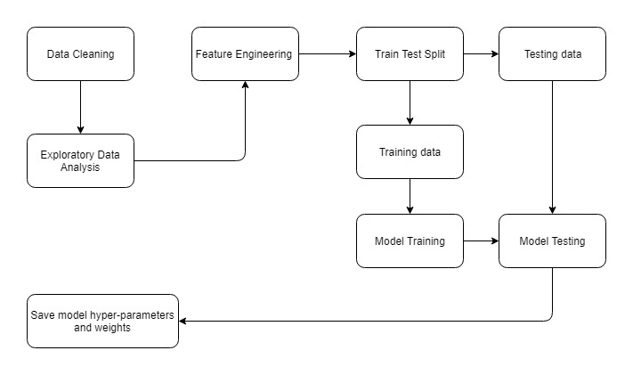

Here we have some example of visualization:
-	Plot a correlation matrix to check whether the rating is correlated to any numerical variable. See Figure 3 beloow.
- Plot a bubblechart of cocoa percent. See Figure 4 below.
- Plot a heatmap of company location vs. ratings over time. See Figure 5 below.

Figure 3 - Correlation Heatmap

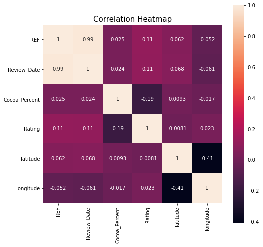

Figure 4. Bubblechart of Cocoa Percent

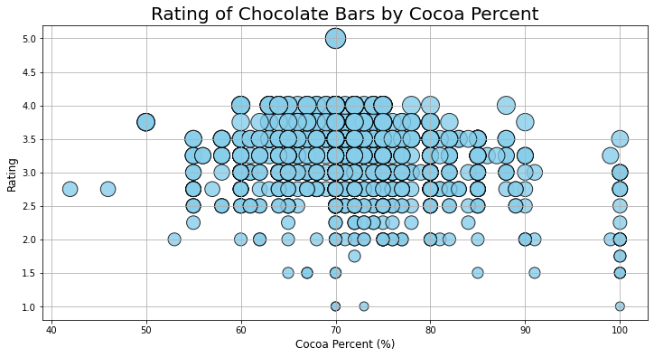

Figure 5. Company Location vs. Ratings over Time

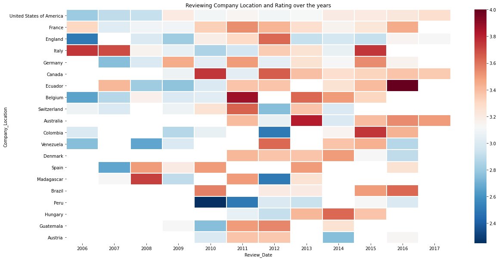

#### Section 2. Presentation: Description of the analysis phase of the project

Once we cleaned our data and analyzed the dataset by creating several visualizations and tables, the team evaluated several machine learning classifier models to predict the rating of a chocolate bar. Then we compared accuracy and performance of all models together to keep the better one. Finally, we set up database and connected our machine learning to AWS.

#### Section 3. GitHub / README.md: Communication protocols

Write-up goes here

#### Section 4. GitHub / README.md: Outline of the project

Write-up goes here

#### Section 5. ML Model: Description of preliminary data preprocessing

The Data cleaning code with some description of a step by step cleaning process can be found in the jupyter notebook file titled "Data_clean.ipynb".

In this phase we made sure there is no inconsistencies within the data set and **correct data types** are linked to all columns.

###### Handling missing and empty values:

We found two null values related to “Bean_Type” and “Broad_Bean_Origin” so tried to handling those missing values by deleting the rows, also we tried to fill null values of 'Ingredients’ and 'Most_Memorable_Characteristics' columns with “missing and unknown” values.

Comparing “Bean_Origin_or_Bar_Name” and “Broad_Bean_Origin “we see they are very similar.  Therefore, we can replace the null values of “Broad_Bean_Origin “with “Bean_Origin_or_Bar_Name” values and drop this column(Bean_Origin_or_Bar_Name)

We know that there are three varieties of Theobroma cacao, as it was officially named in 1753 by the Swedish scientist Carl von Linné. They are criollo, forastero and trinitario, and multiple hybrids exist of each strain.( The Different Cacao Varieties | Willie's Cacao (williescacao.com)) so we cleaned the values in the bean_type column considering these three varieties. In handling the empty values, we noticed that we have 957 instances in which "bean_type" is encoded as space or \xa0, thus we filled those ambiguous missing values with much better alternatives(missing).

###### Check spelling:
The next step was checking spelling for Company Location and Broad_Bean_Origina values which was done.

###### Add new Column(Continent):

We decide to group the Location column(Broad_Bean_Origin) into continents so we could have more compelling graphs in the dashboard.

###### Handling outliers:

We set a threshold value for 'Review_Date' and ‘Cocoa_Percent’ to identify outliers and then remove them.


#### Section 6. ML Model: Description of preliminary feature engineering and preliminary feature selection, including decision-making process

Feature engineering is the process of using domain knowledge of the data to create features that make machine learning algorithms work.

###### Data Cleaning & Preprocessing:

-	Drop Unnecessary columns:

  We drop the following variables because they are not significant as a predictor will not give us any information about the likeability of a chocolate bar, so we will remove them.
  "Company","REF","Bean_Origin_or_Bar_Name","Most_Memorable_Characteristics","continent"

-	Handling **outliers**:

  We identified outliers by visualizing data using scatterplot and histogram then set a threshold value to identify them in each column and then remove them

-	Handling **missing values**:

  Missing data in the training data set can reduce the power/fit of a model. Therefore, we tried to handle this issue in cleaning data step.

-	Handling **skewness**:

  Skewness is a measure of the asymmetry of a distribution. Symmetric distribution is preferred over skewed distribution as it is easier to interpret and generate inferences. In the Rating distribution plot we had left skew so with considering Mean, Standard Deviation and Quartiles, we declare a new function(bin_ratings) to address this issue by labeling “Rating” values.

  Figure 6 - Skewness.

  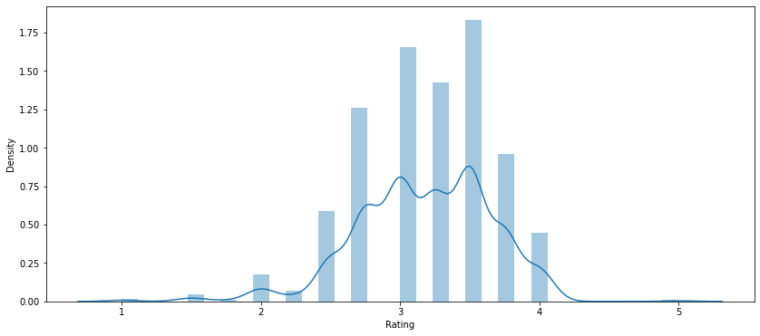

-	Generate a list of **categorical variable names**.

  There are multiple columns with categorical values as well as our numerical values. Instead of searching across all columns and keeping track of which variables need categorical preprocessing, we generated our categorical variable list :

  ```
  # Generate our categorical variable lists

  chocolate_cat = df_chocolate.dtypes[df_chocolate.dtypes == 'object'].index.tolist()

  chocolate_cat

  ['Review_Date','Company_Location','Bean_Type','Broad_Bean_Origin','Ingredients','country_code']
  ```

- **Encoding all categorical data**:

  By looking at chocolate_cat variable, we see there are six categorical variables that need encoding. OneHotEncoder was used to encode the data in preparation for machine learning Models.

- **Features(X) and Target (Y)**

  ```
  (We split Rating values into 2,3 and 4 class sets to improve our machine learning)

  y = df_chocolate["Rating"]

  X = df_chocolate.drop(["Rating"],1)
  ```

  We must split our data into the training and testing sets prior to standardization to not incorporate the testing values into the scale with the train_size=  0.7 and test_size= 0.3.

- **Scaling (Standardize all numerical data.)**

  We standardized our numerical variables using Scikit-learn's StandardScaler module to be between 0 and 1. The standard scaler standardizes the data. This means that each feature will be rescaled so that its mean is 0 and its standard deviation is 1. some models benefits from scaling.

- Rank the **Importance of Features**, which allows us to see which features have the most impact on the decision. See Figure 7 below.

 Figure 7 - Top 10 features in Random Forest Model

 

- **Machine Learning Models Results**:

  In this phase we run several machine learning classifier models:

  -	Random Forest

    This model gives us better accuracy score than the others about 50% with average 62% precision.

  - LogisticRegression

   The accuracy was about 40% with low precisions

  - SVM:

   In this model we got the worst accuracy about 30% with low precisions

  - Deep Learning:

   We started with 4 layers and then extended it to 7 layes with various number of Neurons for each layer and tested with different activation functions such as 'relu' and 'tanh'. None of the attempts made a significant difference in the end results for Model Accuracy.In this model we had high accuracy about 97% but lots of loss near 3.50.

- **We perform the followings to improve our machine learning models**:

   -	Split Rating values into several class sets.

   -	split our data into the training and testing manually

   -	Drop “missing” and “unknown” values

   -	It can be tricky sometimes, try to come up with new attributes or derive attributes from the present data set to domain knowledge and increase the performance of the machine learning model so we add some other columns to our dataset: continent, Ingredients and Most_Memorable_Characteristics

   -	Using Adaptive Boosting (**AdaBoost**)

   -	Using **Oversampling**, we oversample the data using the naive random oversampling algorithm and the **SMOTE** algorithm.

   -	Using **Undersampling**, we undersampled the data using the Cluster Centroids algorithm.

   -	**Combination** approach of **oversampling** and **undersampling**.


#### Section 7. ML Model: Description of how data was split into training and testing sets

We divide the data set into two parts:

-	Training set: Used for training the machine learning model, it can be further divided into a training set and a cross-validation set.

-	 Testing set: Used for the final evaluation of the machine learning.

The train test split can be seamlessly done by sklearn.model_selection.train_test_split from scikit-learn. We decide to split the data into training set (70%) and testing set (30%). We manually specify the desired split with the train_size=  0.7 and test_size= 0.3.


#### Section 8. ML Model: Explanation of model choice, including limitations and benefits

The team evaluated several machine learning classifier models.  These include logistic regression, SVM, RandomForest, Tensor Flow kera neural net, Extra Trees Classifier.  Attempts were made to evalute a binary classification system as well as a multiclass system.  Ratings classes were split into 2,3, and 4 class sets.

- 2 Class sets were split with one class above the mean plus one SD and the other class below the mean plus one SD.

- 3 Class sets split the ratings data as follows:
    - class 1 below the mean minus 1 standard deviation
    - class 2 between 1 standard deviation above and below the mean
    - class 3 above the mean plus 1 standard deviation
- 4 Class sets were split along the 25% quartiles.

4 Class sets were quickly eliminated as they don't have enough samples on the end quartiles dues to the natural split of the ratings data into 0.25 ratings buckets.

Three class sets were used in the multiclass ml models of Random Forest and Extra Trees Classifier.  In both cases the prediction and recall values were subpar at identifying highly rated chocolates.

Figure 8 - Extra Trees Classifier Confusion Matrix

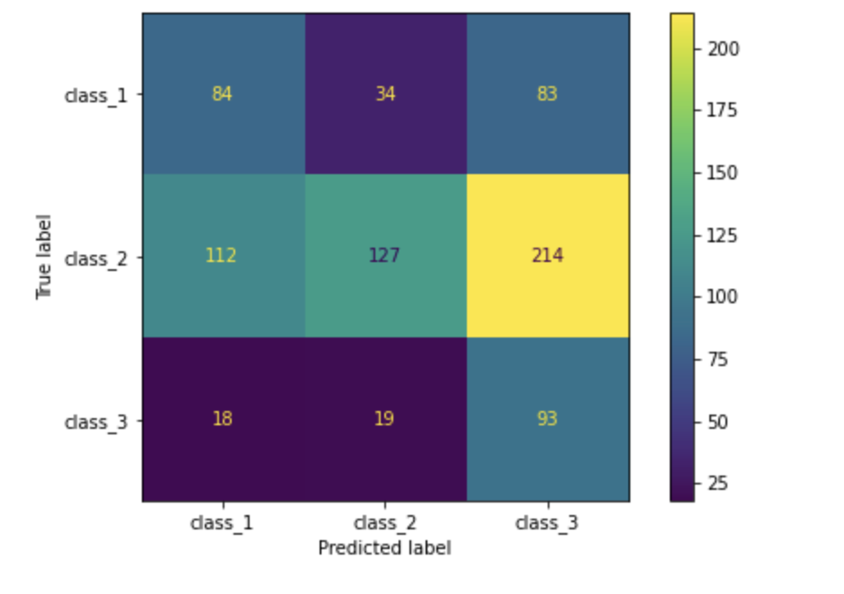

Figure 9 - Extra Trees Classifier Classification Report

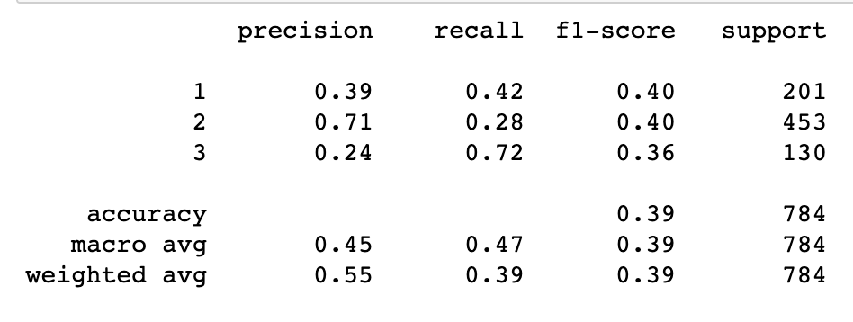

Figure 10 - Random Forest Classifier Confusion Matrix

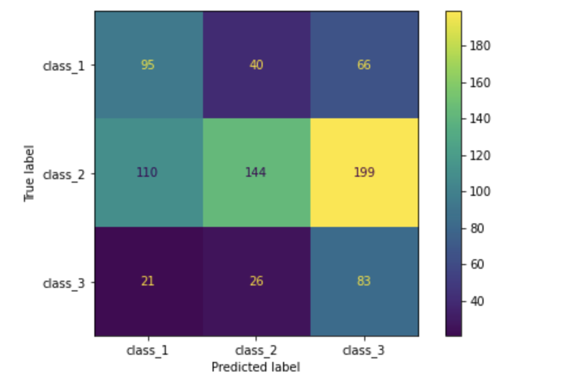

Figure 11 - Random Forest Classifier Classification Report

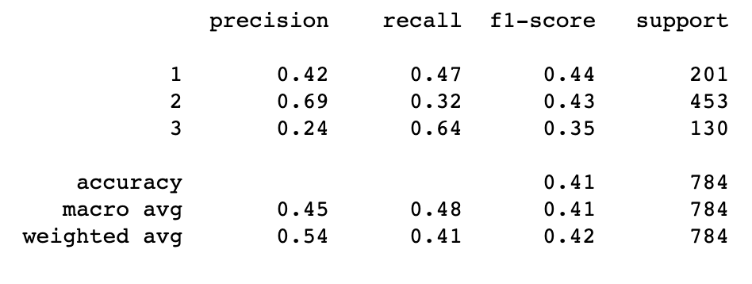

Utilizing the SMOTEENN combination oversample undersample routine with the binary classification system was able to give the best results with and an output of the feature importances.  This resampling combined with the RandomForest classifier produced the best results.

The neural network model had relativiely high loss although its accuracy was the highest of the models.  Unfortunately due to the black box nature of the output it is not possible to glean important imformation as to which features are the most inportance to look for in a chocolate bar.

#### Section 9. Database: Includes at least two tables

This is the current outline of the ETL process and database set up.

Figure 12 - Data Flow Diagram

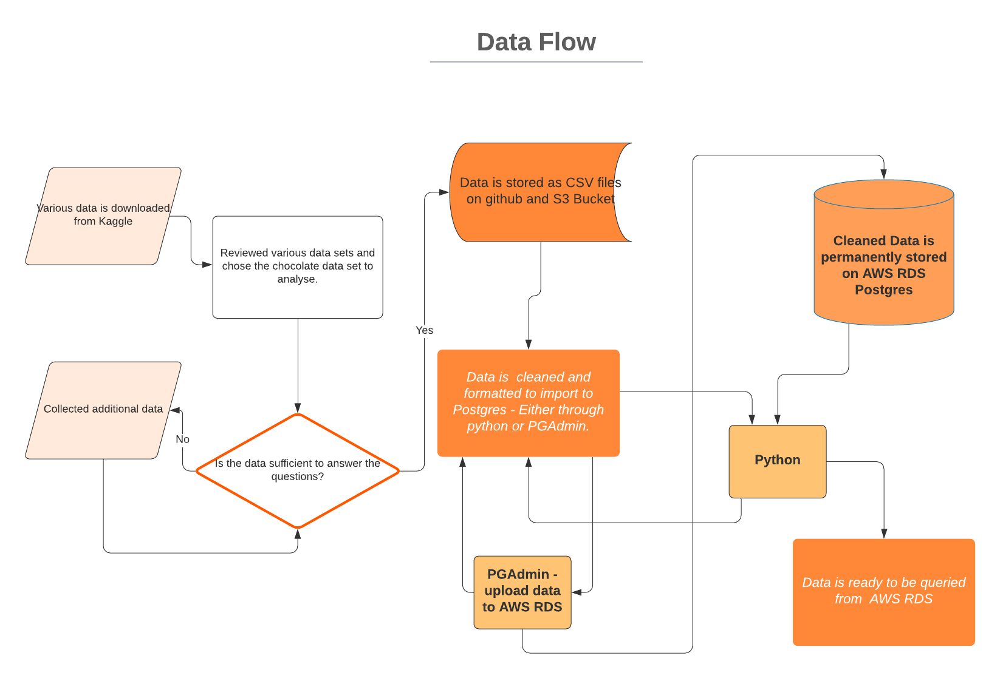


###### AWS RDS and pgAdmin:

* The database contains 2 tables as shown in the schema in the image below. They are linked together through the 'Broad_Bean_Origin_Country' by a one to many relationship.

Figure 13 - Database Schema

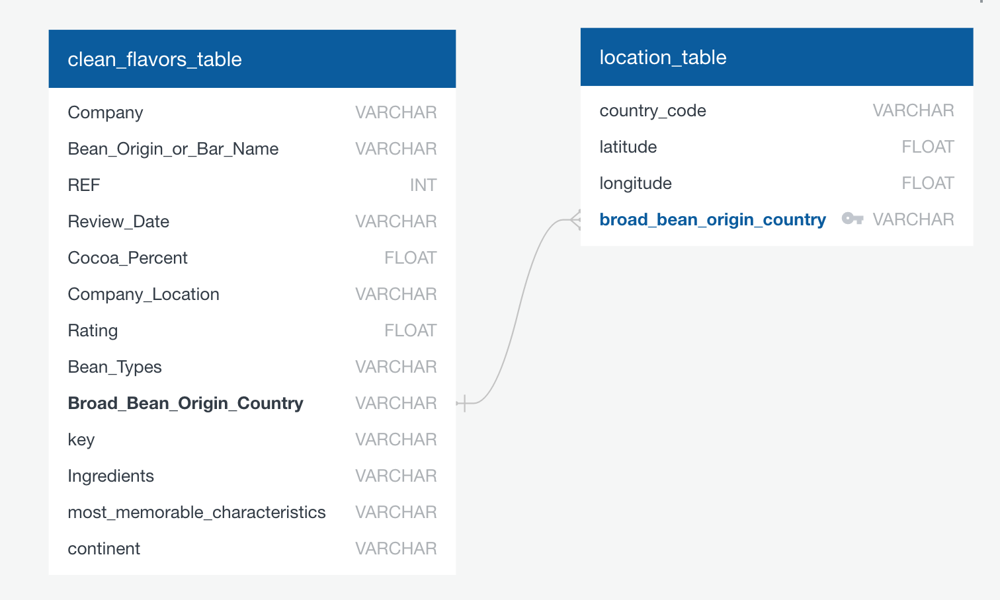

* PgAdmin is connected directly to Amazon RDS. Through pgAdmin, we have imported the cleaned csv files to populate the tables. When the tables are queried, we can view the tables directly in pgAdmin.

Table 3 - pgAdmin Tables

|   |      pgAdmin Tables:     |
|----------|:-------------:|
|clean_flavors_table |  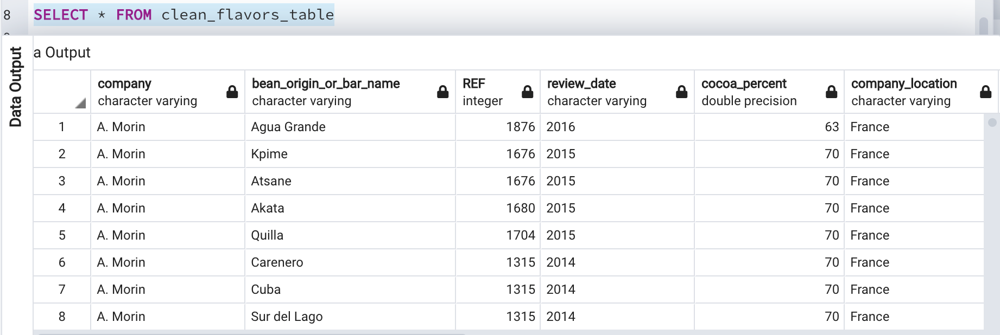 |
| location_table |  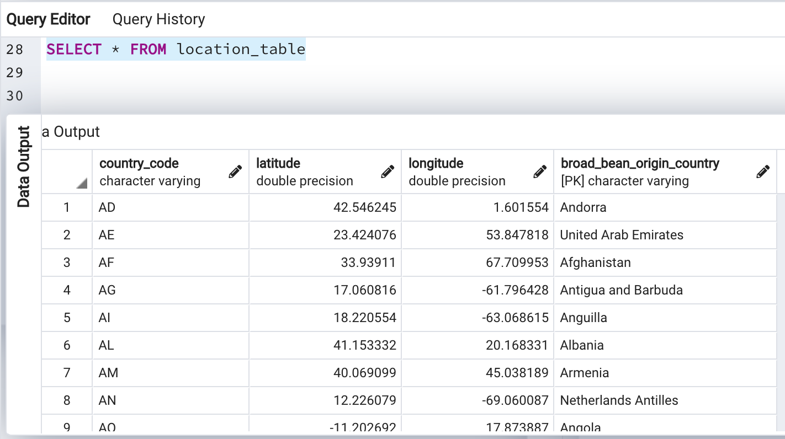  |

###### Connecting to AWS RDS using Python:

* The libraries pyscopg2 and sqlAlchemy will be used to connect to AWS RDS from Jupyter notebooks. Call the connect_to_db function to connect to AWS RDS and enter password.

Figure 14 - Connect to RDS

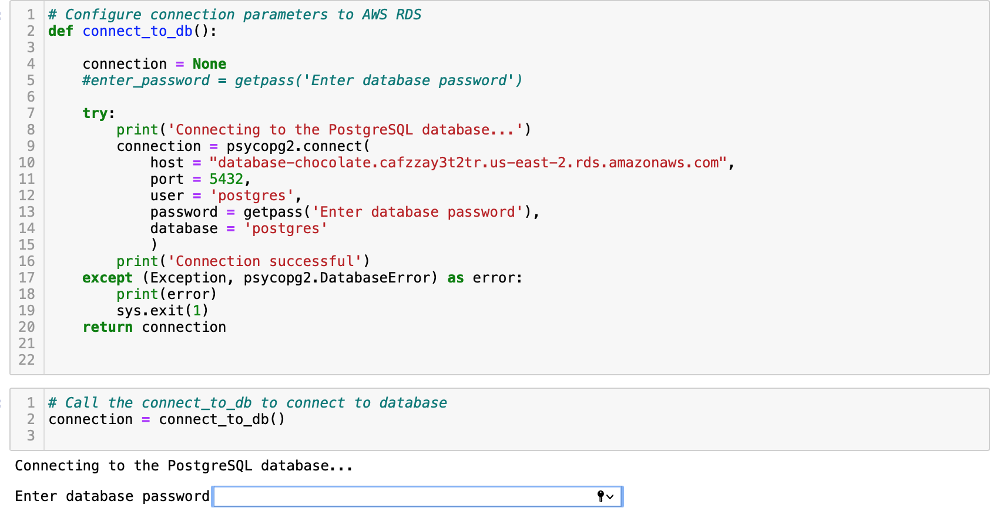

* Confirm that connection has been successful when the message 'connection successful' is printed.

Figure 15 - Connection Confirmed

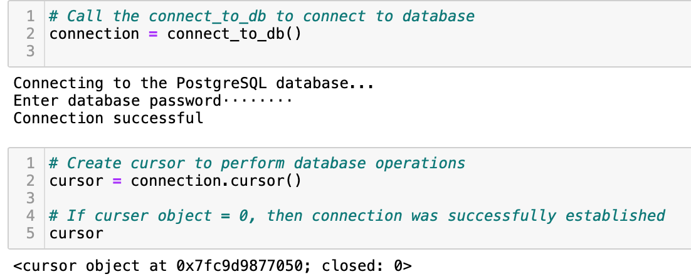


###### Query the RDS in Python (Jupyter Notebooks) and convert to pandas DataFrame to view.

* After connection has been made with the AWS RDS, we can query RDS within """ """ and store the tables in pandas dataframe.

Table 4 - SQL Queries

|  |      SQL Query     |  Output |
|----------|:-------------:|:------:|
| Query to view location_table from RDS |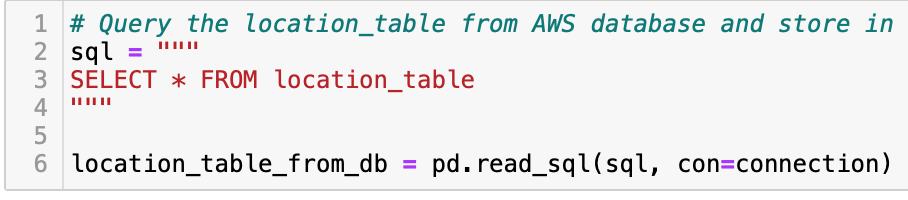 |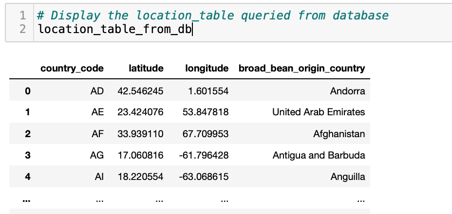 |
| Query to view clean_flavors_table from RDS |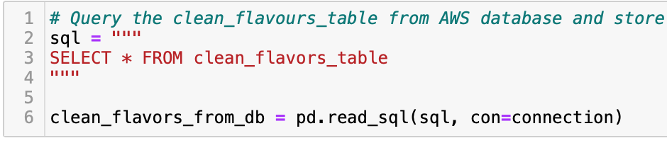 |  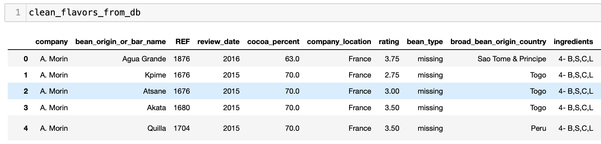 |

#### Section 10. Database: Includes at least at least one join

* As the data is divided into two tables, we can combine the two tables with a 'JOIN' using SQL syntax embedded within 3 quotemarks as shown in below image.
* The two tables will be joined together on the 'broad_bean_origin_country' column.

Figure 16 - SQL to Join Tables

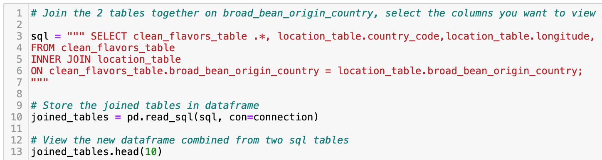

* Output of the combined table (see image below):
    * The columns highlighted within the blue section consists of data from the 'clean_flavors_table' while the columns highlighted within the green section are from the 'location_table'. The highlighted orange section is where the columns were merged on.

* The joined table is now ready to be used for plotting and preprocessing in the machine learning models.

Figure 17 - Resulting Joined Table

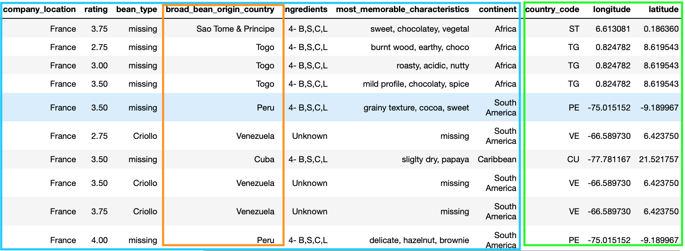


#### Section 11. Dashboard: Storyboard on Google Slides

See [Presentation as Google Slides](https://drive.google.com/drive/folders/1R4K90dXMlQ8stR5bSdv7_Ihnfq-KnghP)

#### Section 12. Dashboard: Description of the tools and interactive elements that will be used to create the final dashboard

Currently we are going to utilize Tableau to create a working dashboard.   Users will be able to select manufacturer country or cocoa bean source country and filter to the data.  Additional filters to allow for rating filters will allow a user to rapidly look at where the best rated bar and their bean sources are located.

## Summary

**To be completed in future segments**

## Appendix 1

Table A1 - Rubric for Segment1

| Segment | Item | Details |Points |
| :--     | :--  | :--     |   --: |
| 1 | [Presentation](https://github.com/jilek/DataBootcampFinalProject/blob/main/Segment2_Deliverable/Chocolate%20Bar%20Ratings%20Predictor.pdf)                           |                            |  30 |
|   | Selected topic                                                 | Done: (see Overview above) |     |
|   | Reason for topic                                               | Done: (see Overview above) |     |
|   | Desc. of data source                                           | Done: (see Overview above) |     |
|   | Questions we want to answer                                    | Done: (see Overview above) |     |
| 1 | GitHub                                                         |                            |  10 |
|   | Main branch includes a README.md                               | Done: this file            |     |
|   | README.md includes communication protocols                     | Done: Slack                |     |
|   | At least one branch for each team member                       | Done                       |     |
|   | Each member has at least 4 commits.                            | Done                       |     |
| 1 | [ML model](https://github.com/jilek/DataBootcampFinalProject/blob/main/Segment2_Deliverable/ChocolateBarRatings.ipynb) |  |  35 |
|   | Takes in data from the provisional database                    | Done: CSV for now          |     |
|   | Outputs label(s) for input data                                | Done: we predict 'Rating'  |     |
| 1 | Database                                                       |                            |  25 |
|   | Sample data the mimics the expected final DB schema            | Done: ERD and SQL now      |     |
|   | Draft machine learning module is connected to the provional DB | Done: CSV for now          |     |
| 1 | Dashboard                                                      |                            |   0 |
|   | n/a for segment 1                                              |                            |     |
| 1 | **Total**                                                      |                            | 100 |
