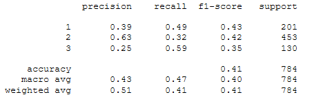

### Machine Learning Model selection
The team evaluated several machine learning classifier models.  These include logistic regression, SVM, RandomForest, Balanced Random Forest, EasyEnsemble, Tensor Flow kera neural net, Extra Trees Classifier.  Attempts were made to evalute a binary classification system as well as a multiclass system.  Ratings classes were split into 2,3, and 4 class sets.

- 2 Class sets were split with one class above the mean plus one SD and the other class below the mean plus one SD.

- 3 Class sets split the ratings data as follows:
    - class 1 below the mean minus 1 standard deviation
    - class 2 between 1 standard deviation above and below the mean
    - class 3 above the mean plus 1 standard deviation
- 4 Class sets were split along the 25% quartiles.

4 Class sets were quickly eliminated as they don't have enough samples on the end quartiles dues to the natural split of the ratings data into 0.25 ratings buckets.

Three class sets were used in the multiclass ml models of Random Forest and Extra Trees Classifier.  In both cases the prediction and recall values were subpar at identifying highly rated chocolates.

Utilizing the SMOTEENN combination oversample undersample routine with the binary classification system was able to give the best results with and an output of the feature importances.  This resampling combined with the RandomForest classifier produced the best results.

The neural network model had relativiely high loss although its accuracy was the highest of the models.  Unfortunately due to the black box nature of the output it is not possible to glean important imformation as to which features are the most inportance to look for in a chocolate bar.

### Machine Learning Segment 3
The team continues to refine the ML process. We added a Balanced Random Forest Classifier and tested different balancing routines including Naive Random Oversampling and Easy Ensemble AdaBoost Classifier. Additional changes were made to the parameters including changing the criterion from gini to entropy. This change coupled with adjusting max depth , N_estimators and max features made modest improvements to the Balanced Random Forest and Random Forest models.

We tried to play with different random_state but finally we got better result when random_state=42. Team also tried to test the model with splitting the dataset into test_size= 0.2 and train_size=0.8 which provided us better performance. 

In this step Logestic Regression and Random forest(max_depth) model give us high accuracy with high performance. 

Random Forest around 85%

Logestic Regression around 82%

####  Storyboard

See Google slides

#### Tools and interactive elements for dashboard

Currently we are going to utilize Tableau to create a working dashboard.   Users will be able to select manufacturer country or cocoa bean source country and filter to the data.  Additional filters to allow for rating filters will allow a user to rapidly look at where the best rated bar and their bean sources are located.
